# AlphaFxTrader - Forex Trading Application

A comprehensive forex trading application that tracks real-time exchange rates, calculates moving averages, and provides an intuitive dashboard for currency analysis.

## 🚀 Features

### Core Functionality
- **Real-time Data Fetching**: Automatically fetches forex rates from Exchange Rate API every minute
- **Moving Averages**: Calculates SMA (Simple Moving Average) for 3, 5, and 15-minute periods
- **User Authentication**: JWT-based authentication with individual and institutional user types
- **Interactive Dashboard**: Real-time currency rates display with trend indicators
- **Chart Visualization**: Interactive charts showing moving averages for selected currency pairs

### Technical Features
- **RESTful API**: Well-structured backend API with proper error handling
- **Database Storage**: MongoDB for storing forex data and user information
- **Responsive Design**: Mobile-friendly frontend interface
- **Real-time Updates**: Live data updates every minute
- **Security**: JWT authentication with password hashing

## 🏗️ System Architecture

```
┌─────────────────┐    ┌─────────────────┐    ┌─────────────────┐
│   Frontend      │    │   Backend       │    │   Database      │
│   (React)       │◄──►│   (Node.js)     │◄──►│   (MongoDB)     │
│                 │    │                 │    │                 │
│ - Dashboard     │    │ - API Routes    │    │ - Users         │
│ - Authentication│    │ - Auth Middleware│    │ - Forex Data    │
│ - Charts        │    │ - Data Services │    │ - Moving Averages│
└─────────────────┘    └─────────────────┘    └─────────────────┘
                                │
                                ▼
                       ┌─────────────────┐
                       │  External API   │
                       │ (Exchange Rate) │
                       └─────────────────┘
```

## 📊 Database Design

### Collections

#### Users Collection
```javascript
{
  _id: ObjectId,
  username: String (unique),
  email: String (unique),
  password: String (hashed),
  userType: String (enum: ['individual', 'institutional']),
  isActive: Boolean,
  lastLogin: Date,
  tradingVolume: Number,
  maxTradingVolume: Number,
  createdAt: Date,
  updatedAt: Date
}
```

#### ForexData Collection
```javascript
{
  _id: ObjectId,
  base: String (3 chars),
  target: String (3 chars),
  pair: String (indexed),
  rate: Number,
  timestamp: Date (indexed),
  source: String,
  sma3: Number,
  sma5: Number,
  sma15: Number
}
```

## 🔌 API Design

### Authentication Endpoints
- `POST /api/auth/register` - Register new user
- `POST /api/auth/login` - User login
- `GET /api/auth/profile` - Get user profile (protected)
- `PUT /api/auth/profile` - Update user profile (protected)

### Forex Data Endpoints
- `GET /api/forex/latest-rates` - Get latest exchange rates
- `GET /api/forex/available-pairs` - Get available currency pairs
- `GET /api/forex/historical/:pair` - Get historical data for pair (protected)
- `GET /api/forex/moving-averages/:pair` - Get moving averages for pair (protected)
- `GET /api/forex/stats` - Get database statistics

### Response Format
```javascript
{
  success: Boolean,
  data: Object | Array,
  message: String,
  timestamp: Date
}
```

## 🧮 Trading Logic Explanation

### Moving Average Calculation

The application implements Simple Moving Average (SMA) calculations for three time periods:

1. **SMA 3**: Average of last 3 data points
2. **SMA 5**: Average of last 5 data points  
3. **SMA 15**: Average of last 15 data points

### Algorithm Flow

```mermaid
graph TD
    A[Fetch Exchange Rates] --> B[Store in Database]
    B --> C[Calculate Moving Averages]
    C --> D[Update Database Records]
    D --> E[Determine Trend Signal]
    E --> F{Current Rate vs SMAs}
    F -->|Rate > All SMAs| G[Bullish Signal 📈]
    F -->|Rate < All SMAs| H[Bearish Signal 📉]
    F -->|Mixed| I[Neutral Signal ➡️]
    G --> J[Display on Dashboard]
    H --> J
    I --> J
```



### Trend Analysis
- **Bullish**: Current rate is above all three moving averages
- **Bearish**: Current rate is below all three moving averages
- **Neutral**: Current rate is between the moving averages

## 🚀 Deployment Instructions

### Prerequisites
- Node.js (v14 or higher)
- MongoDB (v4.4 or higher)
- npm or yarn

### Backend Setup

1. **Install Dependencies**
   ```bash
   cd backend
   npm install
   ```

2. **Environment Configuration**
   Create a `.env` file in the backend directory:
   ```env
   MONGO_URI=mongodb://localhost:27017/alphafxtrader
   JWT_SECRET=your_super_secret_jwt_key_here
   JWT_EXPIRE=24h
   PORT=5000
   NODE_ENV=development
   ```

3. **Start the Server**
   ```bash
   npm run dev
   ```

### Frontend Setup

1. **Install Dependencies**
   ```bash
   cd frontend
   npm install
   ```

2. **Start the Development Server**
   ```bash
   npm start
   ```

### Production Deployment

1. **Build Frontend**
   ```bash
   cd frontend
   npm run build
   ```

2. **Start Backend in Production**
   ```bash
   cd backend
   npm start
   ```

## 📱 User Interface

### Dashboard Features
- **Real-time Rates Table**: Shows current exchange rates for all currency pairs
- **Moving Averages Display**: SMA 3, 5, and 15 values for each pair
- **Trend Indicators**: Visual indicators for bullish/bearish/neutral trends
- **Interactive Charts**: Click on any currency pair to view moving average charts
- **User Profile**: Display user type and trading volume information

### Authentication
- **Registration**: Create account with individual or institutional user type
- **Login**: Secure JWT-based authentication
- **Profile Management**: Update user information

## 🔧 Configuration

### Environment Variables

#### Backend (.env)
```env
MONGO_URI=mongodb://localhost:27017/alphafxtrader
JWT_SECRET=your_super_secret_jwt_key_here
JWT_EXPIRE=24h
PORT=5000
NODE_ENV=development
```

#### Frontend (.env)
```env
REACT_APP_API_URL=http://localhost:5000
```

### API Configuration
- **Data Fetch Interval**: Every 1 minute (configurable in server.js)
- **Moving Average Windows**: 3, 5, and 15 data points
- **JWT Expiration**: 24 hours (configurable)

## 🧪 Testing

### Manual Testing
1. Register a new user account
2. Login with credentials
3. View the dashboard with real-time rates
4. Select different currency pairs to view charts
5. Verify moving averages are calculated correctly

### API Testing
Use tools like Postman or curl to test API endpoints:

```bash
# Test health endpoint
curl http://localhost:5000/health

# Test latest rates
curl http://localhost:5000/api/forex/latest-rates

# Test authentication
curl -X POST http://localhost:5000/api/auth/login \
  -H "Content-Type: application/json" \
  -d '{"email":"test@example.com","password":"password123"}'
```

## 📈 Performance Considerations

### Database Optimization
- Indexed fields: `pair`, `timestamp`
- Compound indexes for efficient queries
- Automatic cleanup of old data (configurable)

### API Performance
- Efficient aggregation queries for latest rates
- Pagination for historical data
- Caching of frequently accessed data

### Frontend Optimization
- Lazy loading of chart components
- Debounced API calls
- Responsive design for mobile devices

## 🔒 Security Features

### Authentication & Authorization
- JWT tokens with expiration
- Password hashing using bcrypt
- Protected routes with middleware
- User type-based access control

### Data Security
- Input validation and sanitization
- CORS configuration
- Environment variable protection
- Secure API endpoints

## 🚀 Future Enhancements

### Planned Features
- **Trading Algorithms**: Implement RSI, Bollinger Bands
- **Backtesting**: Historical strategy performance analysis
- **WebSocket Integration**: Real-time data streaming
- **Machine Learning**: AI-powered trading signals
- **Portfolio Management**: Track trading positions
- **Risk Management**: Stop-loss and take-profit orders

### Technical Improvements
- **Microservices Architecture**: Split into smaller services
- **Redis Caching**: Improve data retrieval performance
- **Docker Containerization**: Easy deployment and scaling
- **CI/CD Pipeline**: Automated testing and deployment
- **Monitoring**: Application performance monitoring

## 📞 Support

For technical support or questions:
- Check the API documentation at `/health` endpoint
- Review the console logs for error messages
- Ensure MongoDB is running and accessible
- Verify all environment variables are set correctly

## 📄 License

This project is licensed under the MIT License - see the LICENSE file for details.

---

**AlphaFxTrader** - Empowering traders with real-time forex data and intelligent analysis tools.
